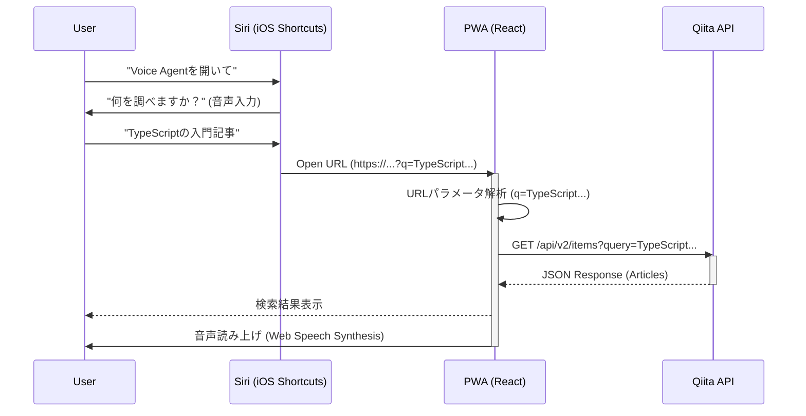

# アーキテクチャ設計書 (Architecture Design)

## 1. 技術スタック
- **Frontend Framework**: React (v18+)
- **Language**: TypeScript
- **Build Tool**: Vite
- **PWA Support**: `vite-plugin-pwa`
- **Styling**: Vanilla CSS (CSS Modules or standard CSS) - *User Rule: Vanilla CSS preferred*
- **Hosting**: Vercel (推奨: HTTPS必須かつデプロイが容易)

## 2. システム構成図



## 3. ディレクトリ構造
```
src/
├── components/
│   ├── ArticleList.tsx    # 記事一覧表示
│   └── VoiceStatus.tsx    # 音声状態表示
├── hooks/
│   ├── useQiitaSearch.ts  # API検索ロジック
│   └── useQueryParam.ts   # URLパラメータ取得
├── services/
│   └── qiita.ts           # Qiita APIクライアント
├── App.tsx
└── main.tsx
```

## 4. Siriショートカット設定（ユーザー側設定）
アプリ実装外だが、システムの一部として定義する。
1.  **アクション**: "入力を要求" (テキスト/音声)
2.  **アクション**: "URLを開く" -> `https://<app-url>/?q=<入力>`

## 5. 制約と対策
- **iOS PWAでの音声認識不可**:
    - **対策**: 入力はSiriショートカットに委譲する。アプリ内での再検索が必要な場合は、テキスト入力を基本としつつ、ブラウザモードでの利用を促すUIを表示する。
